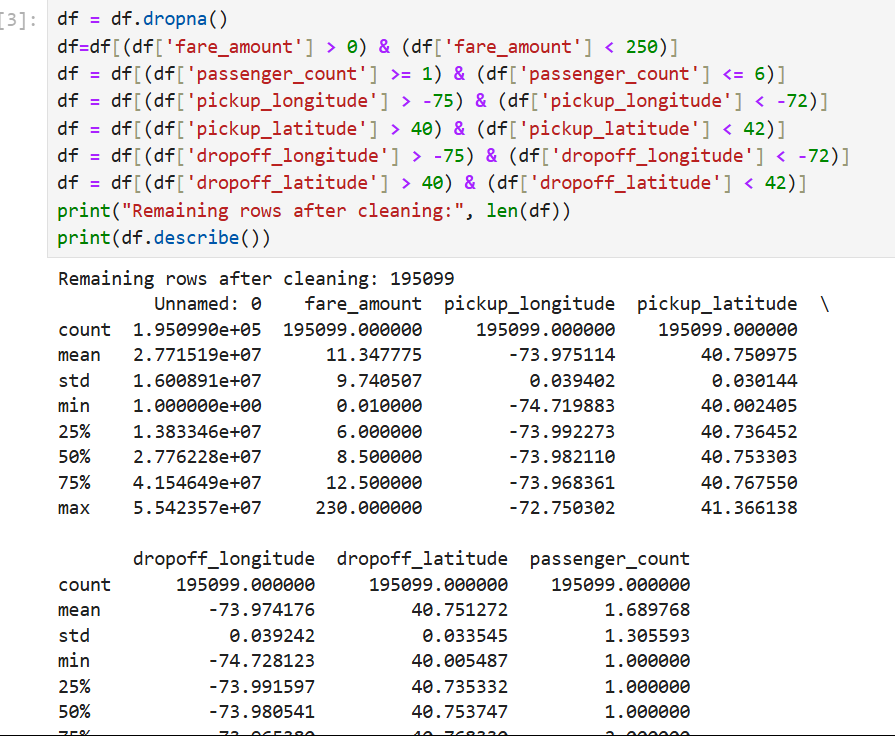
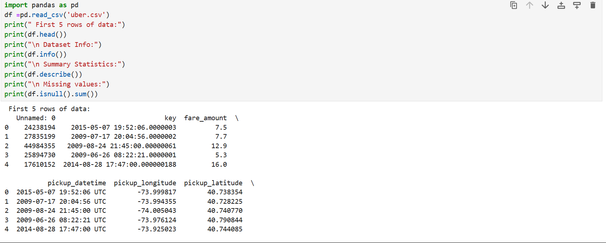
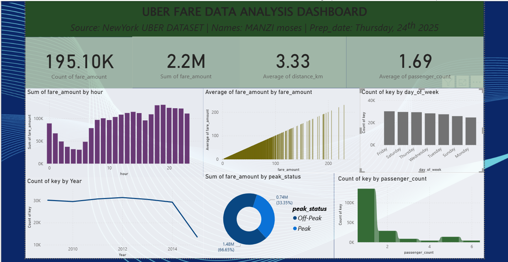

## UBER FARE DATASET ANALYSIS USING Python & Power BI

## Introduction
This project presents a comprehensive analysis of the Uber Fare Dataset, combining the power of Python for data preparation and exploratory analysis, and Power BI for interactive dashboard development.

The primary goal is to explore fare structures, temporal trends, ride distances, and spatial patterns of Uber rides. This analysis helps uncover deeper insights that could support decision-making for urban transportation systems or ride-sharing platforms.

Key project highlights include:

> Data Cleaning and Transformation using Python

> Exploratory Data Analysis to reveal hidden patterns

>Interactive Power BI Dashboard to visualize ride patterns over time and space

By the end of this project, we aim to deliver not only technical outputs, but also business insights that reflect a real-world data-driven approach.


## Installation & Setup Instructions

### Python Environment

* Use **Jupyter Notebook**  for initial data exploration.
* Install required libraries using:

  ```bash
  pip install pandas numpy matplotlib seaborn
  ```

### Power BI Desktop

* Download and install Power BI Desktop from the official Microsoft website: [Power BI](https://powerbi.microsoft.com/desktop/)

---

## Dataset Used

The dataset used is the **Uber Fares Dataset**, sourced from [Kaggle](https://www.kaggle.com/). It contains:

* Pickup and dropoff coordinates
* Timestamp of ride
* Fare amount
* Passenger count
* Distance traveled

---

##  Data Cleaning & Preparation

1. Loaded dataset into **Pandas DataFrame**
2. Explored structure, data types, and dimensions
3. Removed records with:

   * Missing coordinates
   * Negative or zero fare values
   * Incomplete timestamps
4. Exported cleaned data as `.csv` for Power BI

---

## Feature Engineering

* Extracted `hour`, `day`, `month`, and `weekday` from timestamp
* Flagged `peak vs. off-peak hours`
* Created `trip duration` and `trip distance`
* Saved enriched dataset for Power BI import


## Power BI Dashboard

After cleaning and feature engineering in Python, the dataset was imported into Power BI to create the following:

* **Fare distribution** (histograms & boxplots)
* **Time-series analysis** (hour/day/month/year trends)
* **Geographic visualizations** using maps
* **Filters and slicers** for interactivity

##  Screenshots Included

1. Data Cleaning in Jupyter Notebook

3. Feature Engineering Code Output

5. Power BI Report Pages
6. Interactive Dashboard Filters

7. Final Result Summary Visual

(All images are inside the `/screenshots` folder)

---

