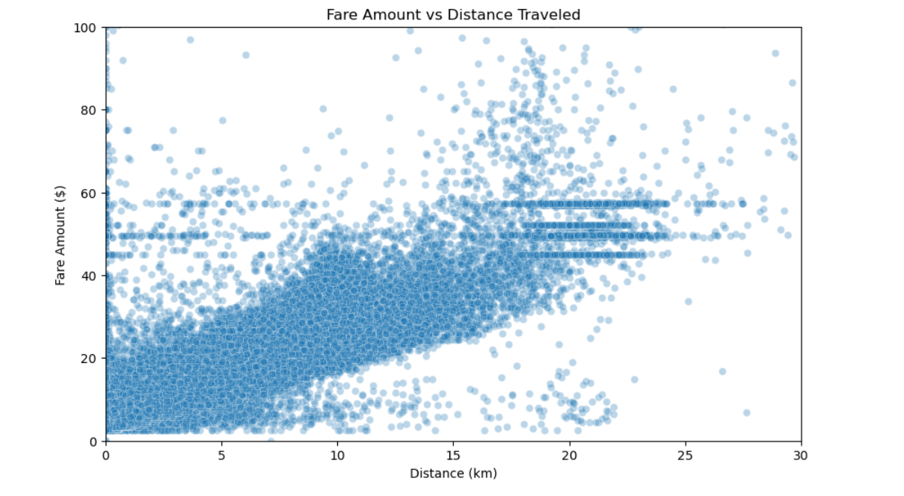

## Visualization: Fare vs Distance Traveled
```Python
plt.figure(figsize=(10,6))
sns.scatterplot(x='distance_km', y='fare_amount', data=df, alpha=0.3)
plt.title("Fare Amount vs Distance Traveled")
plt.xlabel("Distance (km)")
plt.ylabel("Fare Amount ($)")
plt.xlim(0, 30)
plt.ylim(0, 100)
plt.show()
```
## screenshoot



