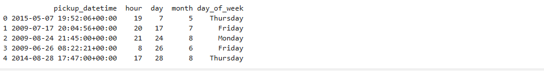
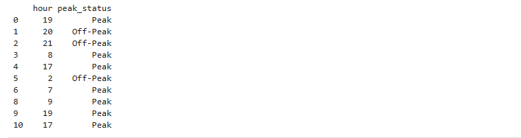

# Description of What Is Being Done:
This section extracts useful time-based features from the original pickup_datetime column. These features are crucial for understanding patterns in Uber rides based on time and day.
# Extracting Time Features:
```python
df['pickup_datetime'] = pd.to_datetime(df['pickup_datetime'])
df['hour'] = df['pickup_datetime'].dt.hour
df['day'] = df['pickup_datetime'].dt.day
df['month'] = df['pickup_datetime'].dt.month
df['day_of_week'] = df['pickup_datetime'].dt.day_name()
print(df[['pickup_datetime', 'hour', 'day', 'month', 'day_of_week']].head())
```
# outputs

# What is that happens with the above codes:
Converts the pickup datetime string into actual datetime format and then extracts:

hour → Hour of the day (0–23)

day → Day of the month

month → Month of the year

day_of_week → Name of the day (e.g., Monday)

Useful for analyzing daily/weekly/hourly ride trends.
# Classifying Peak and off-peak Hours:
```python
def peak_status(hour):
    if 7 <= hour <= 9 or 16 <= hour <= 19:
        return "Peak"
    else:
        return "Off-Peak"

df['peak_status'] = df['hour'].apply(peak_status)
print(df[['hour', 'peak_status']].head(10))
```
# Output

# And Here we are doing these:
Adds a new column that labels each ride as "Peak" or "Off-Peak" depending on the hour:

Peak hours: 7–9 AM and 4–7 PM (rush hours)

Off-Peak hours: everything else

This is helpful for analyzing fare surges, demand, or traffic influence.


